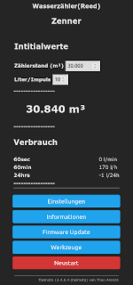

# TASMOREED
A collection of ini-files, scripts and links to smarten your gas or water-meter with [arendst/Tasmota](https://github.com/arendst/Tasmota)

## When to use?
* You have a gas or water meter equipped with a reed contact (or a similar device) to count pulses.
* You are willing to custom build TASMOTA
* Your home automation software speaks MQTT
## What is needed?
* An ESP8266 based development board, such as the [WEMOS-D1-mini][1].   
The ini-file can be adapted to support other microcontrollers such as the ESP32.
* A [Micro-USB-Charger][4] (for production use)
* a gas meter or water meter with a pulse output (such as a reed contact)
* A microcontroller case for the ESP8266 such as [this one][2].
## HowTo build
1. Clone TASMOTA from [GitHub][3]
2. Copy `user_config_override.h` from this repository into `tasmota/`-subdirectory of your github-clone (replace the existing file).
3. Customize WiFi-settings, most importantly (`STA_*`) and MQTT-host (`MQTT_HOST`)
4. If you want to customize `user_config_override.h` in a way that your own default script is compiled into the binary, use `flatten_script.sh` to generate a string for the `#PRECONFIGURED_SCRIPT` definition.
5. Build TASMOTA and flash ESP with your favourite IDE (such as PlatformIO :wink: )
6. Connect reed-sensor to `D4 (GPIO2)` and `GND`
7. Connect power (USB-Charger, for instance)
## Software Setup
1. Open Webbrowser and browse to `http://tasmoreed/`
2. Set initial value for the current meter reading  ("Zählerstand") and the amount of volume flow per impulse (in case of water: liter/pulse)
2. Make further customizations with the script-editor or settings page.
3. If you need to reset the counter, open Tasmota-console and enter `Counter1 0`
4. By default TASMOREED publishes its data to `/tele/water/SENSOR`

Variables for meter reading, volume flow per pulse and pulse counter are _permanent variables_ and will be restored after a power-down or reboot...
## Published data
The script provides 4 different sensor results:
* `total`: the present meter reading (should be equal to the physical meter)
* `flow60s`: volume flow of the past 60 seconds
* `flow60m`: volume flow of the past 60 minutes. The calculations are based on a _moving window_ approach, the result is recalculated every minute.
* `flow24h`: volume flow of the past 24 hours. The calculations are based on a _moving window_ approach, the result is recalculated every 60 minutes.

Please note that
* Data will only be published, if either of the 4 values change.
* a value of `-1` indicates an invalid result (should only be published within the first 24 hours after a reboot or a previously edited script...)

Flow values can be used to detect a leaking hose pipe and trigger an alarm, for example.   

## Future features
Check issues on this repository.

[1]:<https://www.makershop.de/plattformen/d1-mini/>
[2]:<https://www.thingiverse.com/thing:1603498>
[3]:<https://github.com/arendst/Tasmota.git>
[4]:<https://www.amazon.de/Schnell-Ladeger%C3%A4t-Netzteil-Samsung-Galaxy/dp/B0BGR38LPB/>